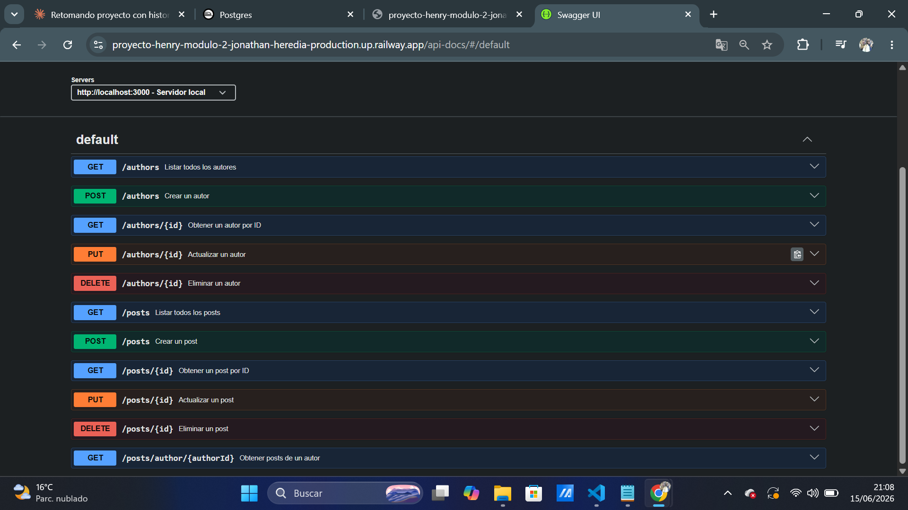
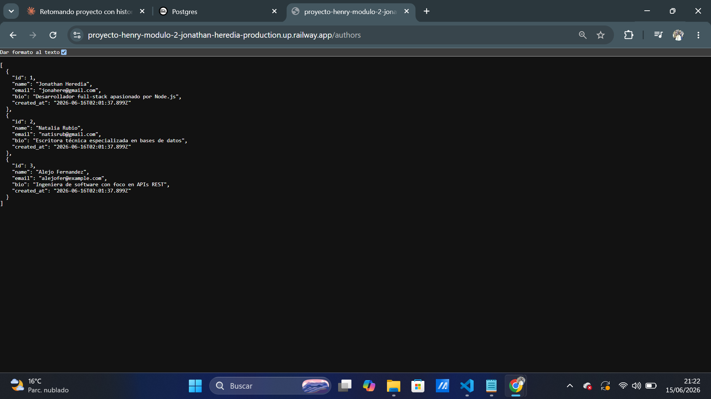
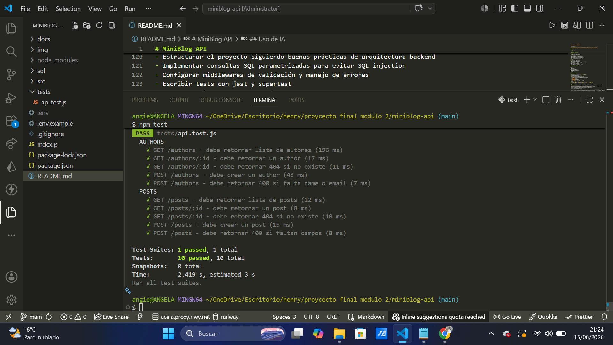
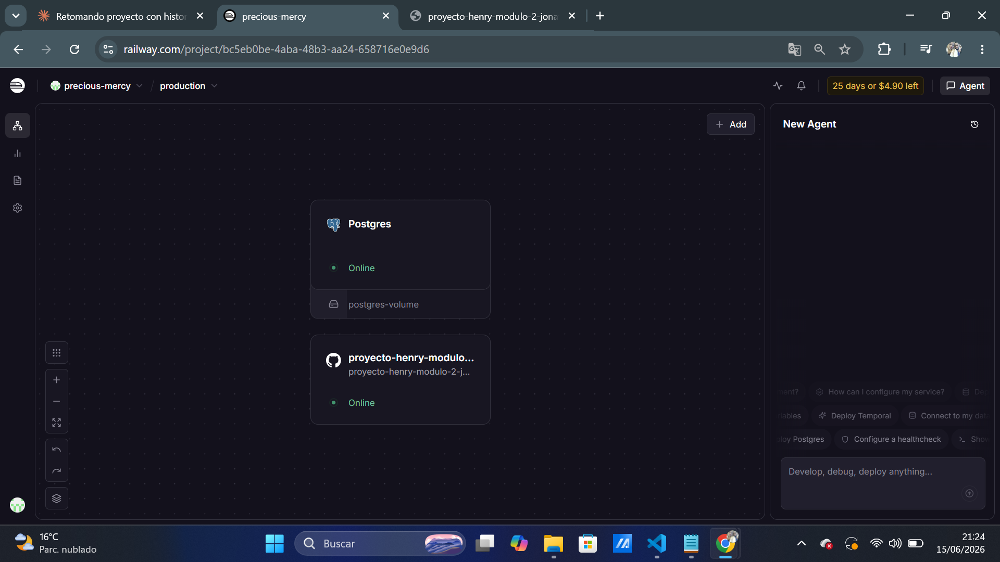
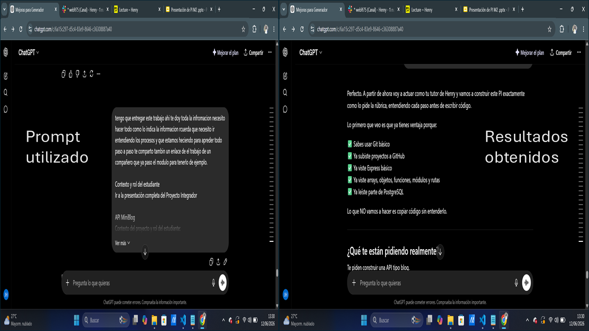
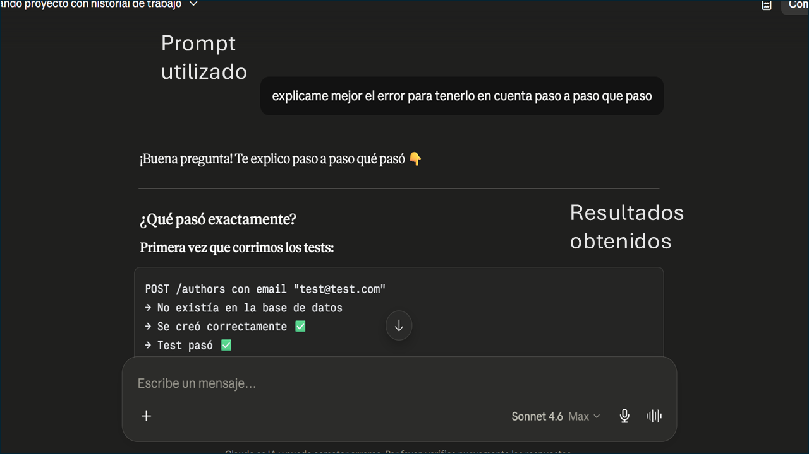
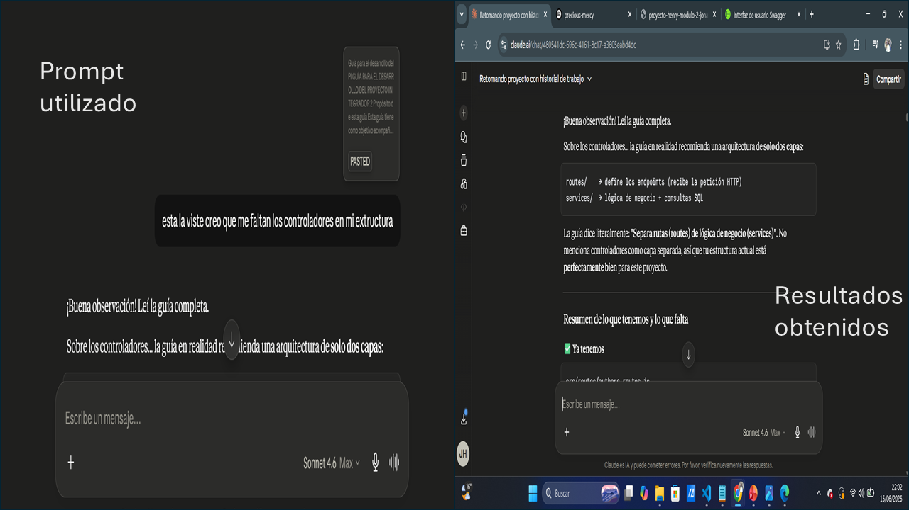
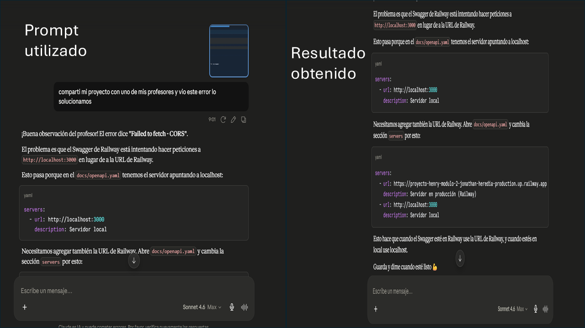
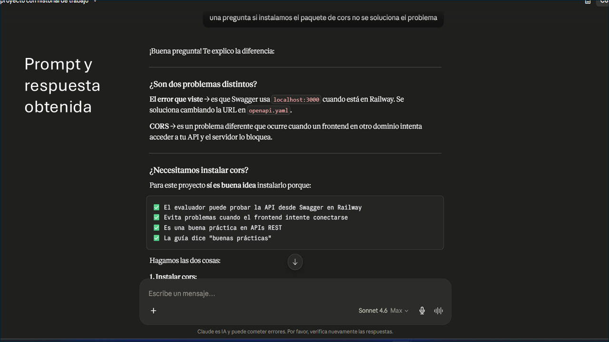

# MiniBlog API

API REST para gestionar autores y posts, construida con Node.js, Express y PostgreSQL.

## 🚀 Demo en producción

- **API:** https://proyecto-henry-modulo-2-jonathan-heredia-production.up.railway.app/authors
- **Documentación Swagger:** https://proyecto-henry-modulo-2-jonathan-heredia-production.up.railway.app/api-docs

## Descripción

MiniBlog es una API desarrollada para DevSpark que permite gestionar usuarios y publicaciones. Implementa operaciones CRUD completas para las entidades `authors` y `posts`.

## Requisitos

- Node.js v18 o superior
- PostgreSQL v14 o superior
- npm

## Instalación y ejecución local

### 1. Clonar el repositorio
```bash
git clone https://github.com/shakatoti1618-wq/proyecto-henry-modulo-2-jonathan-heredia.git
cd proyecto-henry-modulo-2-jonathan-heredia
```

### 2. Instalar dependencias
```bash
npm install
```

### 3. Configurar variables de entorno
```bash
cp .env.example .env
```
Edita el archivo `.env` con tus datos de PostgreSQL.

### 4. Crear la base de datos
```bash
psql -U tu_usuario -d tu_base_de_datos -f sql/setup.sql
psql -U tu_usuario -d tu_base_de_datos -f sql/seed.sql
```

### 5. Ejecutar el servidor
```bash
npm run dev
```
El servidor estará disponible en `http://localhost:3000`

## Documentación OpenAPI



Con el servidor corriendo, abre en el navegador:

`http://localhost:3000/api-docs`

O en producción:

`https://proyecto-henry-modulo-2-jonathan-heredia-production.up.railway.app/api-docs`

## API en producción



## Ejecutar tests



```bash
npm test
```

## Deploy en Railway



1. Crear cuenta en [Railway](https://railway.app)
2. Crear nuevo proyecto → Deploy from GitHub
3. Conectar este repositorio
4. Agregar servicio PostgreSQL en Railway
5. Configurar variables de entorno:
   - `DB_HOST` → Internal host de PostgreSQL en Railway
   - `DB_PORT` → 5432
   - `DB_NAME` → railway
   - `DB_USER` → postgres
   - `DB_PASSWORD` → contraseña de Railway
6. Ejecutar los scripts SQL:
```bash
psql -h HOST_PUBLICO -U postgres -p PUERTO -d railway -f sql/setup.sql
psql -h HOST_PUBLICO -U postgres -p PUERTO -d railway -f sql/seed.sql
```

## Endpoints disponibles

### Authors
| Método | Ruta | Descripción |
|--------|------|-------------|
| GET | /authors | Listar autores |
| GET | /authors/:id | Obtener autor |
| POST | /authors | Crear autor |
| PUT | /authors/:id | Actualizar autor |
| DELETE | /authors/:id | Eliminar autor |

### Posts
| Método | Ruta | Descripción |
|--------|------|-------------|
| GET | /posts | Listar posts |
| GET | /posts/:id | Obtener post |
| GET | /posts/author/:authorId | Posts de un autor |
| POST | /posts | Crear post |
| PUT | /posts/:id | Actualizar post |
| DELETE | /posts/:id | Eliminar post |

## Variables de entorno

```env
DB_HOST=localhost
DB_PORT=5432
DB_NAME=miniblog_db
DB_USER=miniblog_user
DB_PASSWORD=tu_contraseña
PORT=3000
```

## Uso de IA



**Prompt:** "tengo que entregar este trabajo, te doy toda la información, necesito hacer todo como lo indica la información, recuerda que necesito ir entendiendo los procesos paso a paso para aprender"

**Resultado obtenido:** La IA analizó el proyecto completo, identificó los conocimientos previos del estudiante y estableció un plan de trabajo claro para construir la API paso a paso sin copiar código sin entenderlo.



**Prompt:** "explicame mejor el error para tenerlo en cuenta paso a paso que pasó"

**Resultado obtenido:** La IA explicó por qué el test de email duplicado fallaba la segunda vez que se ejecutaba, debido a que PostgreSQL persiste los datos entre ejecuciones. Se solucionó usando `Date.now()` para generar emails únicos en cada test.



**Prompt:** "esta la viste creo que me faltan los controladores en mi estructura"

**Resultado obtenido:** La IA analizó la guía completa y explicó que la arquitectura recomendada solo necesita dos capas (routes y services), confirmando que la estructura del proyecto estaba correctamente organizada.




**Prompt:**comparti mi proyecto con uno de mis profesores y vio este error lo solucionamos.

**Prompt:** "si instalamos el paquete de cors no se soluciona el problema"

**Resultado obtenido:** La IA explicó la diferencia entre el error de URL en Swagger y el problema de CORS. Se instaló el paquete `cors` y se configuró en `app.js` para permitir peticiones desde otros dominios, además de actualizar la URL del servidor en `openapi.yaml` para que Swagger funcione correctamente en Railway.

Todos los conceptos fueron comprendidos y aplicados por el estudiante Jonathan Heredia siguiendo la guía del módulo.


Este proyecto fue desarrollado con asistencia de Claude (Anthropic) como herramienta de apoyo para:
- Estructurar el proyecto siguiendo buenas prácticas de arquitectura backend
- Implementar consultas SQL parametrizadas para evitar SQL injection
- Configurar middlewares de validación y manejo de errores
- Escribir tests con jest y supertest
- Documentar la API con OpenAPI/Swagger

Todos los conceptos fueron comprendidos y aplicados por el estudiante Jonathan Heredia siguiendo la guía del módulo.